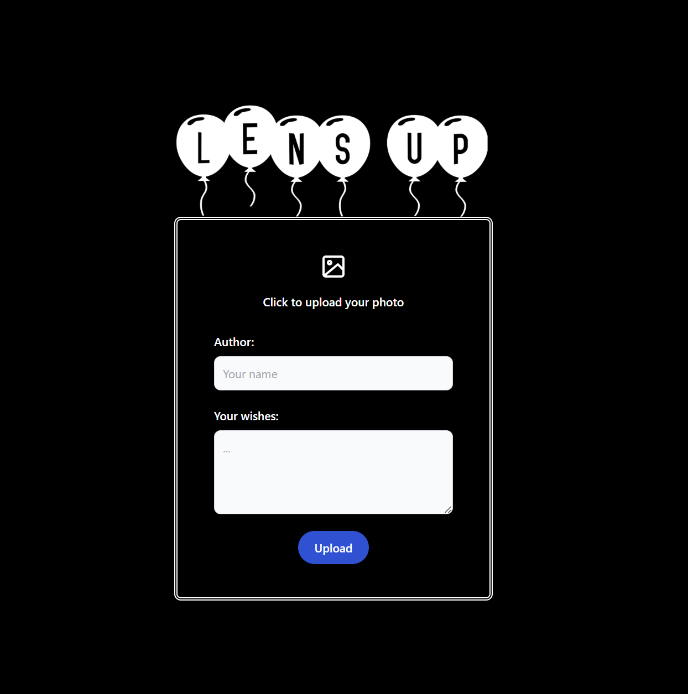

# Photo-Collector-UI

- [Intro](#intro)

- [Major responsibilities](#major-responsibilities)

---

## Intro

The UI Client for the [LensUp.PhotoCollectorServiceAPI](../../../backend-services/photo-collector-service) serves as the user interface for interacting with the backend functionalities. It consists of a single page accessible via the path `/upload-photo/{enterCode}`. The directory structure has been tailored according to the size and requirements of the project. The application design is primarily focused on mobile devices as that's where this functionality will primarily be utilized.

## Major responsibilities

The main purpose of this UI is to upload user photo and wishes to backend service. User can use form on `/upload-photo/{enterCode}` route and upload his data to LensUp gallery.

Route: **/upload-photo/{enterCode}**

